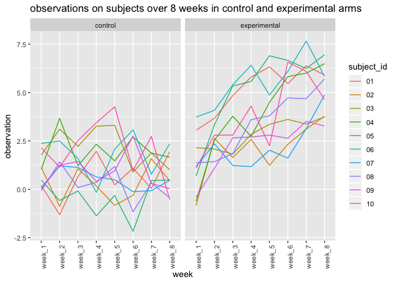

p8105\_hw5\_jl5548
================
J L
November 7, 2019

Problem 1
---------

The code chunk below loads the iris dataset from the tidyverse package and introduces some missing values in each column. The purpose of this problem is to fill in those missing values.

``` r
library(tidyverse)
```

    ## ── Attaching packages ─────────────────────────────────────────────────────── tidyverse 1.2.1 ──

    ## ✔ ggplot2 3.2.1     ✔ purrr   0.3.2
    ## ✔ tibble  2.1.3     ✔ dplyr   0.8.3
    ## ✔ tidyr   1.0.0     ✔ stringr 1.4.0
    ## ✔ readr   1.1.1     ✔ forcats 0.3.0

    ## ── Conflicts ────────────────────────────────────────────────────────── tidyverse_conflicts() ──
    ## ✖ dplyr::filter() masks stats::filter()
    ## ✖ dplyr::lag()    masks stats::lag()

``` r
set.seed(10)

iris_with_missing = iris %>% 
  map_df(~replace(.x, sample(1:150, 20), NA)) %>%
  mutate(Species = as.character(Species))
```

There are two cases to address:

-   For numeric variables, you should fill in missing values with the mean of non-missing values
-   For character variables, you should fill in missing values with "virginica"

Write a function that takes a vector as an argument; replaces missing values using the rules defined above; and returns the resulting vector. Apply this function to the columns of iris\_with\_missing using a map statement.

``` r
## write a function that takes a vector as an argument, replace missing values using rules defined above and returns the resulting vector
fill = function(x){
  if(is.numeric(x)){
    x = x %>% 
      replace_na(mean(x[!is.na(x)])) %>% 
      round(digits = 1)
  } else if (is.character(x)){
    x = x %>% 
      replace_na("virginica")
  }
  x
}

## apply this function to columns of the dataset
iris_with_missing = map_df(.x = iris_with_missing, ~ fill(.x))

## show the dataset
iris_with_missing
```

    ## # A tibble: 150 x 5
    ##    Sepal.Length Sepal.Width Petal.Length Petal.Width Species  
    ##           <dbl>       <dbl>        <dbl>       <dbl> <chr>    
    ##  1          5.1         3.5          1.4         0.2 setosa   
    ##  2          4.9         3            1.4         0.2 setosa   
    ##  3          4.7         3.2          3.8         0.2 virginica
    ##  4          4.6         3.1          1.5         0.2 virginica
    ##  5          5           3.6          1.4         1.2 setosa   
    ##  6          5.4         3.9          1.7         1.2 setosa   
    ##  7          5.9         3.4          1.4         0.3 setosa   
    ##  8          5           3.4          1.5         0.2 setosa   
    ##  9          4.4         2.9          1.4         0.2 setosa   
    ## 10          4.9         3.1          1.5         0.1 setosa   
    ## # … with 140 more rows

Problem 2
---------

Create a tidy dataframe containing data from all participants, including the subject ID, arm, and observations over time:

-   Start with a dataframe containing all file names; the list.files function will help

``` r
df_name = list.files(path = "./data") %>%  # create a vector containing all file names
  as.data.frame() %>%   # turn the vector into a dataframe
  rename("filename" = ".")  # rename the column as "filename"

# display the dataframe
df_name
```

    ##      filename
    ## 1  con_01.csv
    ## 2  con_02.csv
    ## 3  con_03.csv
    ## 4  con_04.csv
    ## 5  con_05.csv
    ## 6  con_06.csv
    ## 7  con_07.csv
    ## 8  con_08.csv
    ## 9  con_09.csv
    ## 10 con_10.csv
    ## 11 exp_01.csv
    ## 12 exp_02.csv
    ## 13 exp_03.csv
    ## 14 exp_04.csv
    ## 15 exp_05.csv
    ## 16 exp_06.csv
    ## 17 exp_07.csv
    ## 18 exp_08.csv
    ## 19 exp_09.csv
    ## 20 exp_10.csv

-   Iterate over file names and read in data for each subject using purrr::map and saving the result as a new variable in the dataframe

``` r
df_long = df_name %>% 
  # use map to read data into a nested column "data"
  mutate(data = map(.x = paste0("./data/", pull(df_name, filename)), read_csv)) %>% 
  # unnest the column "data"
  unnest()
```

    ## Parsed with column specification:
    ## cols(
    ##   week_1 = col_double(),
    ##   week_2 = col_double(),
    ##   week_3 = col_double(),
    ##   week_4 = col_double(),
    ##   week_5 = col_double(),
    ##   week_6 = col_double(),
    ##   week_7 = col_double(),
    ##   week_8 = col_double()
    ## )
    ## Parsed with column specification:
    ## cols(
    ##   week_1 = col_double(),
    ##   week_2 = col_double(),
    ##   week_3 = col_double(),
    ##   week_4 = col_double(),
    ##   week_5 = col_double(),
    ##   week_6 = col_double(),
    ##   week_7 = col_double(),
    ##   week_8 = col_double()
    ## )
    ## Parsed with column specification:
    ## cols(
    ##   week_1 = col_double(),
    ##   week_2 = col_double(),
    ##   week_3 = col_double(),
    ##   week_4 = col_double(),
    ##   week_5 = col_double(),
    ##   week_6 = col_double(),
    ##   week_7 = col_double(),
    ##   week_8 = col_double()
    ## )
    ## Parsed with column specification:
    ## cols(
    ##   week_1 = col_double(),
    ##   week_2 = col_double(),
    ##   week_3 = col_double(),
    ##   week_4 = col_double(),
    ##   week_5 = col_double(),
    ##   week_6 = col_double(),
    ##   week_7 = col_double(),
    ##   week_8 = col_double()
    ## )
    ## Parsed with column specification:
    ## cols(
    ##   week_1 = col_double(),
    ##   week_2 = col_double(),
    ##   week_3 = col_double(),
    ##   week_4 = col_double(),
    ##   week_5 = col_double(),
    ##   week_6 = col_double(),
    ##   week_7 = col_double(),
    ##   week_8 = col_double()
    ## )
    ## Parsed with column specification:
    ## cols(
    ##   week_1 = col_double(),
    ##   week_2 = col_double(),
    ##   week_3 = col_double(),
    ##   week_4 = col_double(),
    ##   week_5 = col_double(),
    ##   week_6 = col_double(),
    ##   week_7 = col_double(),
    ##   week_8 = col_double()
    ## )
    ## Parsed with column specification:
    ## cols(
    ##   week_1 = col_double(),
    ##   week_2 = col_double(),
    ##   week_3 = col_double(),
    ##   week_4 = col_double(),
    ##   week_5 = col_double(),
    ##   week_6 = col_double(),
    ##   week_7 = col_double(),
    ##   week_8 = col_double()
    ## )
    ## Parsed with column specification:
    ## cols(
    ##   week_1 = col_double(),
    ##   week_2 = col_double(),
    ##   week_3 = col_double(),
    ##   week_4 = col_double(),
    ##   week_5 = col_double(),
    ##   week_6 = col_double(),
    ##   week_7 = col_double(),
    ##   week_8 = col_double()
    ## )
    ## Parsed with column specification:
    ## cols(
    ##   week_1 = col_double(),
    ##   week_2 = col_double(),
    ##   week_3 = col_double(),
    ##   week_4 = col_double(),
    ##   week_5 = col_double(),
    ##   week_6 = col_double(),
    ##   week_7 = col_double(),
    ##   week_8 = col_double()
    ## )
    ## Parsed with column specification:
    ## cols(
    ##   week_1 = col_double(),
    ##   week_2 = col_double(),
    ##   week_3 = col_double(),
    ##   week_4 = col_double(),
    ##   week_5 = col_double(),
    ##   week_6 = col_double(),
    ##   week_7 = col_double(),
    ##   week_8 = col_double()
    ## )
    ## Parsed with column specification:
    ## cols(
    ##   week_1 = col_double(),
    ##   week_2 = col_double(),
    ##   week_3 = col_double(),
    ##   week_4 = col_double(),
    ##   week_5 = col_double(),
    ##   week_6 = col_double(),
    ##   week_7 = col_double(),
    ##   week_8 = col_double()
    ## )
    ## Parsed with column specification:
    ## cols(
    ##   week_1 = col_double(),
    ##   week_2 = col_double(),
    ##   week_3 = col_double(),
    ##   week_4 = col_double(),
    ##   week_5 = col_double(),
    ##   week_6 = col_double(),
    ##   week_7 = col_double(),
    ##   week_8 = col_double()
    ## )
    ## Parsed with column specification:
    ## cols(
    ##   week_1 = col_double(),
    ##   week_2 = col_double(),
    ##   week_3 = col_double(),
    ##   week_4 = col_double(),
    ##   week_5 = col_double(),
    ##   week_6 = col_double(),
    ##   week_7 = col_double(),
    ##   week_8 = col_double()
    ## )

    ## Parsed with column specification:
    ## cols(
    ##   week_1 = col_double(),
    ##   week_2 = col_double(),
    ##   week_3 = col_double(),
    ##   week_4 = col_double(),
    ##   week_5 = col_double(),
    ##   week_6 = col_double(),
    ##   week_7 = col_integer(),
    ##   week_8 = col_double()
    ## )

    ## Parsed with column specification:
    ## cols(
    ##   week_1 = col_double(),
    ##   week_2 = col_double(),
    ##   week_3 = col_double(),
    ##   week_4 = col_double(),
    ##   week_5 = col_double(),
    ##   week_6 = col_double(),
    ##   week_7 = col_double(),
    ##   week_8 = col_double()
    ## )
    ## Parsed with column specification:
    ## cols(
    ##   week_1 = col_double(),
    ##   week_2 = col_double(),
    ##   week_3 = col_double(),
    ##   week_4 = col_double(),
    ##   week_5 = col_double(),
    ##   week_6 = col_double(),
    ##   week_7 = col_double(),
    ##   week_8 = col_double()
    ## )
    ## Parsed with column specification:
    ## cols(
    ##   week_1 = col_double(),
    ##   week_2 = col_double(),
    ##   week_3 = col_double(),
    ##   week_4 = col_double(),
    ##   week_5 = col_double(),
    ##   week_6 = col_double(),
    ##   week_7 = col_double(),
    ##   week_8 = col_double()
    ## )
    ## Parsed with column specification:
    ## cols(
    ##   week_1 = col_double(),
    ##   week_2 = col_double(),
    ##   week_3 = col_double(),
    ##   week_4 = col_double(),
    ##   week_5 = col_double(),
    ##   week_6 = col_double(),
    ##   week_7 = col_double(),
    ##   week_8 = col_double()
    ## )
    ## Parsed with column specification:
    ## cols(
    ##   week_1 = col_double(),
    ##   week_2 = col_double(),
    ##   week_3 = col_double(),
    ##   week_4 = col_double(),
    ##   week_5 = col_double(),
    ##   week_6 = col_double(),
    ##   week_7 = col_double(),
    ##   week_8 = col_double()
    ## )
    ## Parsed with column specification:
    ## cols(
    ##   week_1 = col_double(),
    ##   week_2 = col_double(),
    ##   week_3 = col_double(),
    ##   week_4 = col_double(),
    ##   week_5 = col_double(),
    ##   week_6 = col_double(),
    ##   week_7 = col_double(),
    ##   week_8 = col_double()
    ## )

    ## Warning: `cols` is now required.
    ## Please use `cols = c(data)`

``` r
# display the dataframe
df_long
```

    ## # A tibble: 20 x 9
    ##    filename   week_1 week_2 week_3 week_4 week_5 week_6 week_7 week_8
    ##    <fct>       <dbl>  <dbl>  <dbl>  <dbl>  <dbl>  <dbl>  <dbl>  <dbl>
    ##  1 con_01.csv   0.2  -1.31    0.66   1.96   0.23   1.09   0.05   1.94
    ##  2 con_02.csv   1.13 -0.88    1.07   0.17  -0.83  -0.31   1.58   0.44
    ##  3 con_03.csv   1.77  3.11    2.22   3.26   3.31   0.89   1.88   1.01
    ##  4 con_04.csv   1.04  3.66    1.22   2.33   1.47   2.7    1.87   1.66
    ##  5 con_05.csv   0.47 -0.580  -0.09  -1.37  -0.32  -2.17   0.45   0.48
    ##  6 con_06.csv   2.37  2.5     1.59  -0.16   2.08   3.07   0.78   2.35
    ##  7 con_07.csv   0.03  1.21    1.13   0.64   0.49  -0.12  -0.07   0.46
    ##  8 con_08.csv  -0.08  1.42    0.09   0.36   1.18  -1.16   0.33  -0.44
    ##  9 con_09.csv   0.08  1.24    1.44   0.41   0.95   2.75   0.3    0.03
    ## 10 con_10.csv   2.14  1.15    2.52   3.44   4.26   0.97   2.73  -0.53
    ## 11 exp_01.csv   3.05  3.67    4.84   5.8    6.33   5.46   6.38   5.91
    ## 12 exp_02.csv  -0.84  2.63    1.64   2.58   1.24   2.32   3.11   3.78
    ## 13 exp_03.csv   2.15  2.08    1.82   2.84   3.36   3.61   3.37   3.74
    ## 14 exp_04.csv  -0.62  2.54    3.78   2.73   4.49   5.82   6      6.49
    ## 15 exp_05.csv   0.7   3.33    5.34   5.57   6.9    6.66   6.24   6.95
    ## 16 exp_06.csv   3.73  4.08    5.4    6.41   4.87   6.09   7.66   5.83
    ## 17 exp_07.csv   1.18  2.35    1.23   1.17   2.02   1.61   3.13   4.88
    ## 18 exp_08.csv   1.37  1.43    1.84   3.6    3.8    4.72   4.68   5.7 
    ## 19 exp_09.csv  -0.4   1.08    2.66   2.7    2.8    2.64   3.51   3.27
    ## 20 exp_10.csv   1.09  2.8     2.8    4.3    2.25   6.57   6.09   4.64

-   Tidy the result; manipulate file names to include control arm and subject ID, make sure weekly observations are “tidy”, and do any other tidying that’s necessary

``` r
df_long_tidy = df_long %>% 
  # separate the the column filename into two columns:  "arm" and "subject_id"
  separate(filename, into = c("arm", "subject_id"), sep = "_") %>% 
  mutate(
    # remove ".csv" at the end of each subject_id
    subject_id = str_remove(subject_id, pattern = ".csv"),
    # replace "con" as "control" 
    arm = str_replace(arm, "con", "control"),
    # replace "exp" as "experimental"
    arm = str_replace(arm, "exp", "experimental")
  )

# display the dataframe
df_long_tidy
```

    ## # A tibble: 20 x 10
    ##    arm   subject_id week_1 week_2 week_3 week_4 week_5 week_6 week_7 week_8
    ##    <chr> <chr>       <dbl>  <dbl>  <dbl>  <dbl>  <dbl>  <dbl>  <dbl>  <dbl>
    ##  1 cont… 01           0.2  -1.31    0.66   1.96   0.23   1.09   0.05   1.94
    ##  2 cont… 02           1.13 -0.88    1.07   0.17  -0.83  -0.31   1.58   0.44
    ##  3 cont… 03           1.77  3.11    2.22   3.26   3.31   0.89   1.88   1.01
    ##  4 cont… 04           1.04  3.66    1.22   2.33   1.47   2.7    1.87   1.66
    ##  5 cont… 05           0.47 -0.580  -0.09  -1.37  -0.32  -2.17   0.45   0.48
    ##  6 cont… 06           2.37  2.5     1.59  -0.16   2.08   3.07   0.78   2.35
    ##  7 cont… 07           0.03  1.21    1.13   0.64   0.49  -0.12  -0.07   0.46
    ##  8 cont… 08          -0.08  1.42    0.09   0.36   1.18  -1.16   0.33  -0.44
    ##  9 cont… 09           0.08  1.24    1.44   0.41   0.95   2.75   0.3    0.03
    ## 10 cont… 10           2.14  1.15    2.52   3.44   4.26   0.97   2.73  -0.53
    ## 11 expe… 01           3.05  3.67    4.84   5.8    6.33   5.46   6.38   5.91
    ## 12 expe… 02          -0.84  2.63    1.64   2.58   1.24   2.32   3.11   3.78
    ## 13 expe… 03           2.15  2.08    1.82   2.84   3.36   3.61   3.37   3.74
    ## 14 expe… 04          -0.62  2.54    3.78   2.73   4.49   5.82   6      6.49
    ## 15 expe… 05           0.7   3.33    5.34   5.57   6.9    6.66   6.24   6.95
    ## 16 expe… 06           3.73  4.08    5.4    6.41   4.87   6.09   7.66   5.83
    ## 17 expe… 07           1.18  2.35    1.23   1.17   2.02   1.61   3.13   4.88
    ## 18 expe… 08           1.37  1.43    1.84   3.6    3.8    4.72   4.68   5.7 
    ## 19 expe… 09          -0.4   1.08    2.66   2.7    2.8    2.64   3.51   3.27
    ## 20 expe… 10           1.09  2.8     2.8    4.3    2.25   6.57   6.09   4.64

Make a spaghetti plot showing observations on each subject over time, and comment on differences between groups.

``` r
# create a dataframe for the plot
df_plot = df_long_tidy %>% 
  # convert all observations from week 1 to week 8 into one column "observation" with the label column "week"
  pivot_longer(
    cols = week_1:week_8,
    names_to = "week",
    values_to = "observation"
  )
# make the plot
plot_long = df_plot %>% 
  # set values for x and y axes, and different colors according to subject_id
  ggplot(aes(x = week, y = observation, color = subject_id)) +
  # add lines to connect observations through 8 weeks for each subject
  geom_line(aes(group = subject_id)) + 
  # separate by control and experimental arms
  facet_grid(.~arm) + 
  # add titles
  labs(
    title = "observations on subjects over 8 weeks in control and experimental arms",
    x = "week",
    y = "observation"
  ) +
  # adjust the x_axis texts to make it readable
  theme(axis.text.x = element_text(angle = 90, hjust = 1))

# display the plot
plot_long
```



As shown in the plot, at the first week, the experimental arm has overall higher observation value than the control arm. Furthermore, the experimental arm experienced an overall increase in observation value which did not show in the control arm.

Problem 3
---------

In this problem, you will conduct a simulation to explore power in a simple linear regression.

First set the following design elements:

-   Fix n=30
-   Fix xi1 as draws from a standard Normal distribution
-   Fix β0=2
-   Fix σ2=50

Set β1=0. Generate 10000 datasets from the model yi = β0 + β1xi1 + ϵi with ϵi∼N\[0,σ2\]. For each dataset, save β̂1 and the p-value arising from a test of H:β1=0 using α=0.05. Hint: to obtain the estimate and p-value, use broom::tidy to clean the output of lm.

``` r
# write a simulation function to simulate data from a simple linear regression
sim_regression = function(n, beta0, beta1, sig_square) {
  # generate simulation data
  sim_data = tibble(
    x = rnorm(n, mean = 0, sd = 1),
    y = beta0 + beta1 * x + rnorm(n, 0, sqrt(sig_square))
  )
  # fit data with linear model
  ls_fit = lm(y ~ x, data = sim_data) %>% broom::tidy()
  # reveal the result
  tibble(
    beta1_hat = ls_fit[[2, "estimate"]],
    p_value = ls_fit[[2, "p.value"]]
  )
}

# generate 10000 datasets
sim_results = 
  rerun(10000, sim_regression(30, 2, 0, 50)) %>% 
  bind_rows()

# show the first 6 rows of the result dataset
head(sim_results)
```

    ## # A tibble: 6 x 2
    ##   beta1_hat p_value
    ##       <dbl>   <dbl>
    ## 1     0.716  0.562 
    ## 2     2.13   0.171 
    ## 3    -1.48   0.256 
    ## 4     2.06   0.174 
    ## 5     1.32   0.205 
    ## 6    -2.69   0.0253

Repeat the above for β1={1,2,3,4,5,6}, and complete the following:

``` r
# create a function to run several simulations
sim_n_regressions = function(n_runs = 10000, n = 30, beta0 = 2, beta1, sig_square = 50){
  rerun(n_runs, sim_regression(n, beta0, beta1, sig_square)) %>% 
    bind_rows()
}

# generate output for β1={1,2,3,4,5,6}
sim_results = 
  tibble(beta1 = c(0, 1, 2, 3, 4, 5, 6)) %>% 
  mutate(beta1_hat = map(.x = beta1, ~sim_n_regressions(beta1 = .x))) %>% 
  unnest
```

    ## Warning: `cols` is now required.
    ## Please use `cols = c(beta1_hat)`

``` r
# reveal the first 6 rows of the result dataset
head(sim_results)
```

    ## # A tibble: 6 x 3
    ##   beta1 beta1_hat p_value
    ##   <dbl>     <dbl>   <dbl>
    ## 1     0     0.293   0.819
    ## 2     0    -0.677   0.630
    ## 3     0    -2.38    0.150
    ## 4     0    -0.316   0.855
    ## 5     0     1.10    0.546
    ## 6     0     2.05    0.178

-   Make a plot showing the proportion of times the null was rejected (the power of the test) on the y axis and the true value of β1 on the x axis. Describe the association between effect size and power.

``` r
# create a dataframe for the plot
df_reject = sim_results %>% 
  # add a column "reject" indicating whether the null was rejected for each row
  mutate(reject = ifelse(p_value <= 0.05, 1, 0)) %>% 
  # filter rows where the null was rejected
  filter(reject == 1) %>% 
  # group by value of β1
  group_by(beta1) %>% 
  # summarize the number of rejected null for each value of β1
  summarize(n = n()) %>% 
  # calculate the proportion of rejected null for each value of β1
  mutate(proportion = n/10000)

# create a bar graph showing the proportion of rejected null for each value of β1
plot_reject = df_reject %>% 
  ggplot() +
  geom_bar(aes(x = beta1, y = proportion), stat = "identity") +
  # set the breaks as each value of β1
  scale_x_continuous(
    breaks = c(0, 1, 2, 3, 4, 5, 6)
  ) + 
  # add titles
  labs(
    title = "proportion of times the null rejected",
    x = "β1",
    y = "proportion the null rejected"
  )

# reveal the plot
plot_reject
```


As shown in the plot, power increases as the effect size increases.

-   Make a plot showing the average estimate of β̂1 on the y axis and the true value of β1 on the x axis. Make a second plot (or overlay on the first) the average estimate of β̂1 only in samples for which the null was rejected on the y axis and the true value of β1 on the x axis. Is the sample average of β̂1 across tests for which the null is rejected approximately equal to the true value of β1? Why or why not?

``` r
# create a dataframe for average estimate for β1 in all observations
beta1_all = sim_results %>% 
  # group by β1 value
  group_by(beta1) %>% 
  # calculate and summarize the average estimate of β1 for all observations
  summarize(all = mean(beta1_hat))

# create a dataframe for average estimate for β1 in rejected null observations
beta1_reject = sim_results %>% 
  # add a column "reject" indicating whether the null was rejected for each row
  mutate(reject = ifelse(p_value <= 0.05, 1, 0)) %>% 
  # filter rows where the null was rejected
  filter(reject == 1) %>% 
  # group by value of β1
  group_by(beta1) %>% 
  # summarize the number of rejected null for each value of β1
  summarize(reject = mean(beta1_hat))

# join the two dataframes and make the combined plot
plot_beta1 = left_join(beta1_all, beta1_reject, by = "beta1") %>%  # left join two dataframes by column "beta1"
  # combine two columns of estimates into one
  pivot_longer(
    cols = c(all, reject),
    names_to = "estimate"
  ) %>% 
  # set color according to different estimate groups (all observations or rejected null observations)
  ggplot(aes(x = beta1, y = value, color = estimate)) +
  # for points and lines, categorize according to different estimates groups 
  geom_point(aes(group = estimate)) +
  geom_line(aes(group = estimate)) +
  # set the breaks as each value of β1
  scale_x_continuous(
    breaks = c(0, 1, 2, 3, 4, 5, 6)
  ) + 
  # add titles
  labs(
    title = "average estimate of β1 in all simulations and rejected nulls",
    x = "true value of β1",
    y = "average estimate of β1"
  )

# display the plot
plot_beta1
```


As shown in the plot, the average estimate of β1 in all simulations for each β1 value equals to the true value of β1 (β1 = (0, 1, 2, 3, 4, 5, 6)). However, the average estimate of β1 in samples for which the null was rejected is not equal to the true values of β1. Since the hypothesis test is β1 = (0, 1, 2, 3, 4, 5, 6) for each β1 value, rejecting the null means that in the corresponding simulation, the probability that the estimated β1 value deviates from the true β1 value is large. Therefore, in these cases which there is a large probability that the estimated β1 value deviates fromthe true β1 value, there should also exist deviation between the average estimate of β1 and true value of β1.
